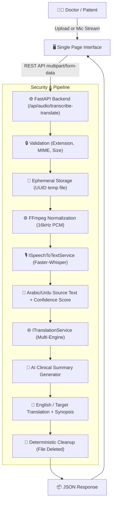

# 🩺 Doctor’s Audio Transcription & Translation System

An enterprise-grade, clinical-focused web application designed to transcribe doctor and patient speech in **Arabic** and **Urdu**, and translate it seamlessly into **English** and other target languages.

---

## 🌟 Key Features

* **Multi-Format Audio Upload**: Supports `.mp3`, `.wav`, `.m4a`, `.webm`, `.ogg`, and `.opus` up to 50 MB with strict server-side validation.
* **In-Browser Voice Recording**: High-fidelity recording using the browser's `MediaRecorder` API accompanied by a real-time **Web Audio API** frequency waveform visualizer on HTML5 Canvas.
* **Dual-Engine Decoupled Architecture**:
  * **Speech-to-Text (STT)**: Decoupled via `ISpeechToTextService` using high-speed, offline `faster-whisper` (CTranslate2) with native Arabic & Urdu vocabulary, anti-hallucination suppression, and cloud Whisper fallback.
  * **Translation**: Decoupled via `ITranslationService` with a multi-engine fallback chain (`MyMemory` $\to$ `GoogleTranslator` $\to$ Auto-Detect $\to$ graceful sanitization).
* **Authentic Multilingual & RTL Typography**: Dynamic Right-to-Left (`dir="rtl"`) layout and custom Google Fonts (`Cairo` for Arabic, `Noto Nastaliq Urdu` for Urdu, `Plus Jakarta Sans` for UI).
* **Clinical Audio Privacy & Security**: Zero permanent retention of audio. Audio is saved to temporary storage with randomized UUIDs and deterministically deleted immediately after processing.
* **🟢 Real-Time Confidence Scores**: Speech recognition token probability calculation displayed directly on the UI badge.
* **🧠 AI-Generated Clinical Summaries**: Automatically generates medical synopses and extracts key clinical symptoms (*Fever, Cough, Headache, Pain, Dyspnea*).
* **📜 Consultation & Translation History Drawer**: Interactive slide-over drawer allowing doctors to review, restore past sessions, export history as `.json`, or clear history.
* **Clinical Productivity Tools**: One-click copy-to-clipboard, `.txt` transcript downloads, text-to-speech audio pronunciation, and one-click sample loaders for testing.

---

## 🏛️ System Architecture



---

## 🚀 Quick Start Guide

### Prerequisites
* Python 3.10+
* `ffmpeg` installed on the host machine (for audio processing)

### 1. Install Dependencies
```bash
pip install -r requirements.txt
```

### 2. Configure Environment (Optional)
Copy `.env.example` to `.env` if you wish to customize configuration:
```bash
cp .env.example .env
```

### 3. Run the Server
```bash
python backend/main.py
```
Or with Uvicorn directly:
```bash
uvicorn backend.main:app --host 0.0.0.0 --port 8000 --reload
```

### 4. Open in Browser
Visit **`http://localhost:8000`** to access the application.

---

## 📡 REST API Reference

### `POST /api/audio/transcribe-translate`
Processes audio file and returns transcription, translation, confidence score, and AI clinical summary.

#### Request (`multipart/form-data`)
| Parameter | Type | Required | Description |
| :--- | :--- | :--- | :--- |
| `audioFile` | Binary File | Yes | Audio file (`.mp3`, `.wav`, `.m4a`, `.webm`, `.ogg`, `.opus`) |
| `sourceLanguage` | String | No | `auto` (default), `ar` (Arabic), or `ur` (Urdu) |
| `targetLanguage` | String | Yes | `en` (default), `ar`, `ur`, `fr`, `es`, `de` |

#### Success Response (`200 OK`)
```json
{
  "success": true,
  "sourceLanguage": "ar",
  "targetLanguage": "en",
  "transcription": "مرحبا يا دكتور، أشعر بألم شديد في المعدة منذ يومين وارتفاع في درجة الحرارة.",
  "translation": "Hello doctor, I have been feeling severe stomach pain for two days and a high fever.",
  "summary": "• Summary: Hello doctor, I have been feeling severe stomach pain for two days and a high fever.\n• Identified Symptoms: Gastric pain, Fever / Pyrexia",
  "confidenceScore": 98.4,
  "durationSeconds": 1.25,
  "detectedLanguageLabel": "Arabic"
}
```

#### Error Response (`400 Bad Request` or `500 Internal Error`)
```json
{
  "success": false,
  "errorCode": "UNSUPPORTED_FORMAT",
  "message": "Unsupported audio format '.pdf'. Supported formats: .mp3, .wav, .m4a, .webm, .ogg, .opus"
}
```

---

## 🧪 Running Automated Tests

Run the full test suite with Pytest:
```bash
pytest backend/tests/ -v
```

---

## 📄 License
Developed for clinical workflow automation and medical language accessibility.
