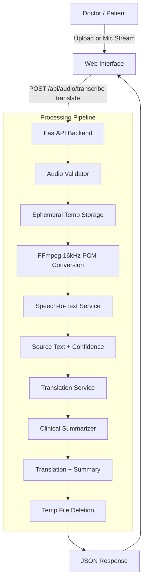

# Doctor Audio Transcription & Translation

A web-based audio transcription and translation application designed for healthcare environments. The system transcribes spoken Arabic and Urdu audio into text and translates the results into English and other target languages.

## Overview

The application provides a single-page workflow:
1. **Audio Input**: Upload audio files (`.mp3`, `.wav`, `.m4a`, `.webm`, `.ogg`, `.opus`) or record live speech via the browser microphone with a real-time waveform visualizer.
2. **Speech Recognition**: Speech-to-text powered by `faster-whisper` (CTranslate2) with native Arabic and Urdu acoustic handling, anti-hallucination controls, and confidence scoring.
3. **Translation**: Multi-engine translation pipeline with language code normalization and fallback handling.
4. **Clinical Summary**: Automatic extraction of key symptoms and consultation synopsis.
5. **Output Display**: Dynamic right-to-left (RTL) rendering for Arabic and Urdu, alongside LTR formatted translations, export tools (.txt download, JSON history), and text-to-speech playback.

## Architecture



## Tech Stack

- **Backend**: Python 3.11, FastAPI, Uvicorn, Pydantic v2
- **Speech Recognition**: Faster-Whisper (CTranslate2)
- **Audio Processing**: FFmpeg
- **Frontend**: HTML5, CSS3 (Tailwind CSS baseline + custom styles), Vanilla JavaScript (Web Audio API, MediaRecorder)
- **Typography**: Google Fonts (Cairo for Arabic, Noto Nastaliq Urdu for Urdu, Plus Jakarta Sans for UI)
- **Testing**: Pytest, Pytest-Asyncio, HTTPX

## Getting Started

### Prerequisites

- Python 3.10 or higher
- `ffmpeg` installed and available in your system PATH

### Installation

1. Clone the repository:
   ```bash
   git clone https://github.com/zuha16817/doctor-audio-translator.git
   cd doctor-audio-translator
   ```

2. Create and activate a virtual environment (optional but recommended):
   ```bash
   python -m venv venv
   # On Windows:
   venv\Scripts\activate
   # On macOS/Linux:
   source venv/bin/activate
   ```

3. Install dependencies:
   ```bash
   pip install -r requirements.txt
   ```

4. (Optional) Configure environment variables:
   ```bash
   cp .env.example .env
   ```

### Running the Application

Start the server:
```bash
python backend/main.py
```

Or using Uvicorn directly:
```bash
uvicorn backend.main:app --host 0.0.0.0 --port 8000 --reload
```

Open your browser and navigate to `http://localhost:8000`.

## API Reference

### `POST /api/audio/transcribe-translate`

Submits an audio recording or file for transcription and translation.

#### Request Form Data (`multipart/form-data`)

| Parameter | Type | Required | Default | Description |
| :--- | :--- | :--- | :--- | :--- |
| `audioFile` | Binary File | Yes | — | Audio file (.mp3, .wav, .m4a, .webm, .ogg, .opus) |
| `sourceLanguage` | String | No | `auto` | `auto`, `ar` (Arabic), or `ur` (Urdu) |
| `targetLanguage` | String | Yes | `en` | Target language code (`en`, `ar`, `ur`, `fr`, `es`, `de`) |

#### Sample Response (`200 OK`)

```json
{
  "success": true,
  "sourceLanguage": "ar",
  "targetLanguage": "en",
  "transcription": "مرحبا يا دكتور، أشعر بألم شديد في المعدة منذ يومين وارتفاع في درجة الحرارة.",
  "translation": "Hello doctor, I have been feeling severe stomach pain for two days and a high fever.",
  "summary": "• Summary: Hello doctor, I have been feeling severe stomach pain for two days and a high fever.\n• Identified Symptoms: Gastric pain, Fever / Pyrexia",
  "confidenceScore": 98.4,
  "durationSeconds": 1.25,
  "detectedLanguageLabel": "Arabic"
}
```

### `GET /api/health`

Returns service health status and active configuration.

### `GET /api/languages`

Returns supported source and target languages.

## Security & Privacy

- **Ephemeral Audio Storage**: Audio files are temporarily saved to disk using randomized UUIDs for processing and immediately deleted inside a `finally` block, ensuring no patient audio is retained.
- **Credential Protection**: All API configurations and keys remain server-side and are never sent to the client.
- **Input Validation**: Strict backend checks on file MIME types, extensions, and file sizes (max 50 MB).

## Running Tests

Run the test suite with Pytest:
```bash
pytest backend/tests/ -v
```

## Project Structure

```
doctor-audio-translator/
├── backend/
│   ├── configuration/      # Settings and environment configuration
│   ├── controllers/        # REST API route handlers
│   ├── models/             # Pydantic data schemas
│   ├── services/
│   │   ├── audio/          # Validation and temp file lifecycle
│   │   ├── speech/         # STT interface, Whisper implementation, summarizer
│   │   └── translation/    # Translation interface and provider adapters
│   ├── temp/               # Ephemeral storage directory
│   ├── tests/              # Unit and integration test suite
│   └── main.py             # FastAPI entry point
├── frontend/
│   ├── css/                # Custom styles, RTL rules, typography
│   ├── js/                 # Web Audio recorder, visualizer, UI controllers
│   ├── samples/            # Test audio samples
│   └── index.html          # Single-page interface
├── requirements.txt
├── .env.example
├── .gitignore
└── README.md
```

## License

MIT
